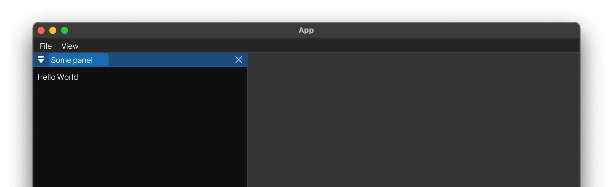

# Base GUI project setup with SDL2

C++ GUI project template with [SDL2](https://www.libsdl.org) and [Dear ImGUI](https://github.com/ocornut/imgui).

## How to get started

After using this template to create your own repository, it is time to first run and then customize!

- Start here: [Quick Start](docs/QuickStart.md)
- Continue here: [Usage Guide](docs/README.md)

## Other versions

If you want another version of this template, on using the template **check the box** to _"Include all branches"_, as
every version is a separate branch. The following versions of this template are included:

- Version 2 - Currently selected
- [Version 1](https://github.com/MartinHelmut/cpp-gui-template-sdl2/tree/version-1) - Older version without CPack

As the SDL2 renderer does not support multi-viewport and detached widgets, there is another version of this template
with [**OpenGL** in a separate repository](https://github.com/MartinHelmut/cpp-gui-template-sdl2-opengl).

## Disclaimer

Special acknowledgment to the amazing open source font [Manrope](https://manropefont.com).
