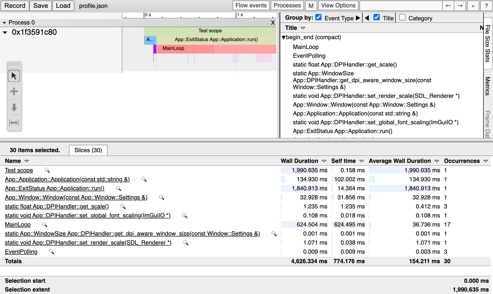

# Profiling

The template comes with a small profiling tool included, defining a set of macros in `src/core/Core/Debug/Instrumentor.hpp`.

**Remark:** For growing application needs consider using another option like tools built into your IDE, or find the right tool here: [List of profiling and benchmarking tools](https://hackingcpp.com/cpp/tools/profilers.html).

## Setup

The profiler is set up inside the application main entry file `src/app/App/Main.cpp`. A profiling session is defined through `APP_PROFILE_BEGIN_SESSION_WITH_FILE` and `APP_PROFILE_END_SESSION`.

The `APP_PROFILE_BEGIN_SESSION_WITH_FILE` macro takes a session name and a file where the profiling results will be written to. The profiler is defined as a set of **macros to be stripped on release** builds.

```c++
#include "Core/Debug/Instrumentor.hpp"

int main() {
  APP_PROFILE_BEGIN_SESSION_WITH_FILE("App", "profile.json");

  // other code ...

  APP_PROFILE_END_SESSION();

  return 0;
}
```

## Add to code

There are two different macros defined to profile code: `APP_PROFILE_FUNCTION` and `APP_PROFILE_SCOPE`.

### `APP_PROFILE_FUNCTION`

This macro will profile a function and will automatically take its name from the function name. It needs to be set at the beginning of the function.

```c++
// src/core/Core/Application.cpp
Application::Application(const std::string& title) {
  APP_PROFILE_FUNCTION();

  // More code ...
  m_window = std::make_unique<Window>(Window::Settings{title});
}
```

To fully capture profiling data all functions should start with the `APP_PROFILE_FUNCTION` macro.

### `APP_PROFILE_SCOPE`

If a custom scope needs to be profiled `APP_PROFILE_SCOPE` can be used. It takes a name for the scope.

```c++
// Example function
int Application::run() {
  // ...

  while (something) {
    APP_PROFILE_SCOPE("MainLoop");

    // loop ...
  }
}
```

## Show results

The resulting JSON file uses the [Trace Event Format](https://docs.google.com/document/d/1CvAClvFfyA5R-PhYUmn5OOQtYMH4h6I0nSsKchNAySU/preview). Any tool that can read this format can visualize the profiler data. For example the web tool [Perfetto](https://ui.perfetto.dev/) or Chromes built in [chrome://tracing](chrome://tracing). Just drag&drop the generated profiler JSON file onto the tool to load it.

This is roughly how this looks like on Chrome.



***

Next up: [Logging](Logging.md)
