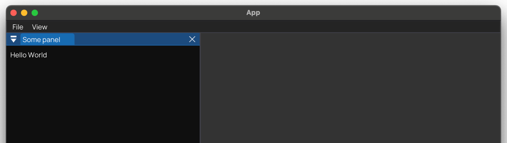
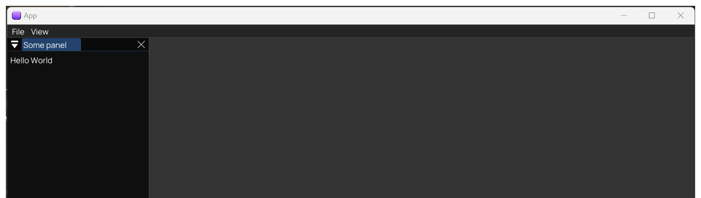
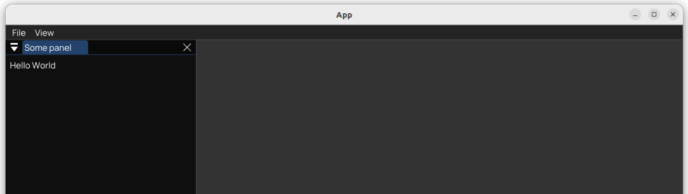

# Quick Start

Having all [requirements](README.md#requirements) set, here you can find how to quickly build and run the application.

## Table of contents

- [Build](#build)
- [Execute](#execute)
  - [macOS](#macos)
  - [Windows](#windows)
  - [Linux](#linux)
- [Distribution](#distribution)
- [Tests](#tests)

## Build

Usually available build modes are `Debug`, `Release`, and `RelWithDebInfo`.

To run a **debug** build:

```shell
cmake -GNinja -DCMAKE_BUILD_TYPE=Debug -B build/debug
cmake --build build/debug
```

To run a **release** build:

```shell
cmake -GNinja -DCMAKE_BUILD_TYPE=Release -B build/release
cmake --build build/release
```

On macOS XCode should be used as generator via `-GXCode`. For example creating a release build with XCode.

```shell
# Using XCode
cmake -GXCode -DCMAKE_BUILD_TYPE=Release -B build/xcode
cmake --build build/xcode
```

## Execute

When not running through an [IDE like CLion](https://www.jetbrains.com/clion), the built application can be run by directly executing the generated binary.

### macOS

To run a **debug** build:

```shell
./build/debug/src/app/App.app/Contents/MacOS/App
```

To run a **release** build:

```shell
./build/release/src/app/App.app/Contents/MacOS/App
```

To run a **debug** build created **with XCode**:

```shell
./build/xcode/src/app/Debug/App.app/Contents/MacOS/App
```

To run a **release** build created **with XCode**:

```shell
./build/xcode/src/app/Release/App.app/Contents/MacOS/App
```

### Windows

To run a **debug** build:

```shell
build/debug/src/app/App.exe
```

To run a **release** build:

```shell
build/release/src/app/App.exe
```

### Linux

To run a **debug** build:

```shell
./build/debug/src/app/App
```

To run a **release** build:

```shell
./build/release/src/app/App
```

## Distribution

To bundle the application and create a distribution package CPack is used. Before executing CPack a [release build needs to be generated](#build).

```shell
cpack --config build/release/CPackConfig.cmake
```

## Tests

On any [generated build](#build) tests can be executed by using CTest, e.g. a Debug build:

```shell
ctest --test-dir build/debug
```

## Preview

Here a preview of the app running on macOS, Windows, and Linux (Ubuntu), in that order.







***

Next up: [Where is What?](WhereIsWhat.md)
